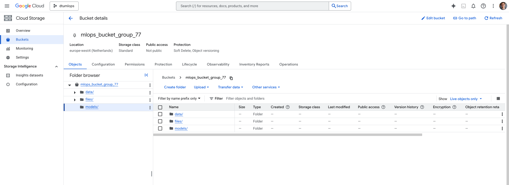
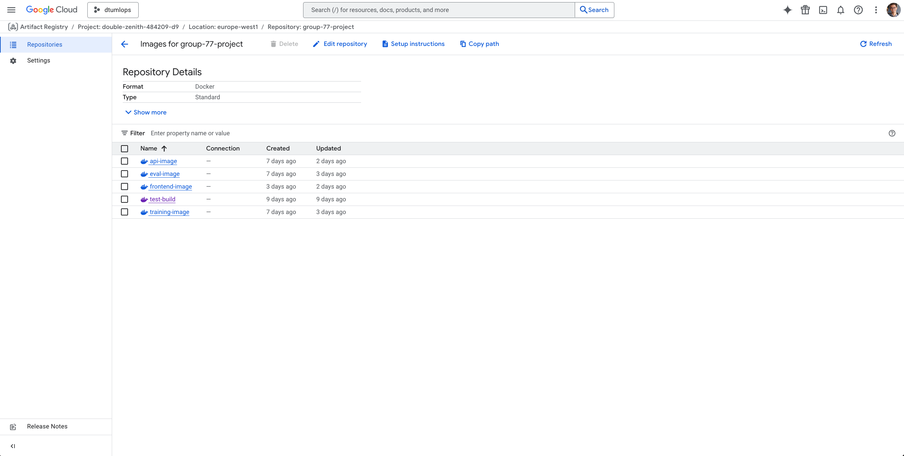
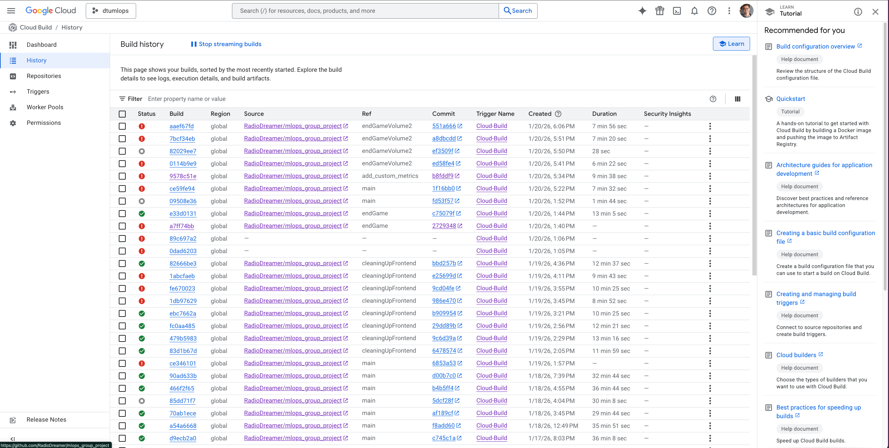

# Exam template for 02476 Machine Learning Operations

This is the report template for the exam. Please only remove the text formatted as with three dashes in front and behind
like:

`--- question 1 fill here ---`

Where you instead should add your answers. Any other changes may have unwanted consequences when your report is
auto-generated at the end of the course. For questions where you are asked to include images, start by adding the image
to the `figures` subfolder (please only use `.png`, `.jpg` or `.jpeg`) and then add the following code in your answer:

``

In addition to this markdown file, we also provide the `report.py` script that provides two utility functions:

Running:

```bash
python report.py html
```

Will generate a `.html` page of your report. After the deadline for answering this template, we will auto-scrape
everything in this `reports` folder and then use this utility to generate a `.html` page that will be your serve
as your final hand-in.

Running

```bash
python report.py check
```

Will check your answers in this template against the constraints listed for each question e.g. is your answer too
short, too long, or have you included an image when asked. For both functions to work you mustn't rename anything.
The script has two dependencies that can be installed with

```bash
pip install typer markdown
```

or

```bash
uv add typer markdown
```

## Overall project checklist

The checklist is _exhaustive_ which means that it includes everything that you could do on the project included in the
curriculum in this course. Therefore, we do not expect at all that you have checked all boxes at the end of the project.
The parenthesis at the end indicates what module the bullet point is related to. Please be honest in your answers, we
will check the repositories and the code to verify your answers.

### Week 1

- [x] Create a git repository (M5)
- [x] Make sure that all team members have write access to the GitHub repository (M5)
- [x] Create a dedicated environment for you project to keep track of your packages (M2)
- [x] Create the initial file structure using cookiecutter with an appropriate template (M6)
- [x] Fill out the `data.py` file such that it downloads whatever data you need and preprocesses it (if necessary) (M6)
- [x] Add a model to `model.py` and a training procedure to `train.py` and get that running (M6)
- [x] Remember to either fill out the `requirements.txt`/`requirements_dev.txt` files or keeping your
      `pyproject.toml`/`uv.lock` up-to-date with whatever dependencies that you are using (M2+M6)
- [x] Remember to comply with good coding practices (`pep8`) while doing the project (M7)
- [x] Do a bit of code typing and remember to document essential parts of your code (M7)
- [x] Setup version control for your data or part of your data (M8)
- [x] Add command line interfaces and project commands to your code where it makes sense (M9)
- [x] Construct one or multiple docker files for your code (M10)
- [x] Build the docker files locally and make sure they work as intended (M10)
- [x] Write one or multiple configurations files for your experiments (M11)
- [x] Used Hydra to load the configurations and manage your hyperparameters (M11)
- [x] Use profiling to optimize your code (M12)
- [x] Use logging to log important events in your code (M14)
- [x] Use Weights & Biases to log training progress and other important metrics/artifacts in your code (M14)
- [x] Consider running a hyperparameter optimization sweep (M14)
- [x] Use PyTorch-lightning (if applicable) to reduce the amount of boilerplate in your code (M15)

### Week 2

- [x] Write unit tests related to the data part of your code (M16)
- [x] Write unit tests related to model construction and or model training (M16)
- [x] Calculate the code coverage (M16)
- [x] Get some continuous integration running on the GitHub repository (M17)
- [x] Add caching and multi-os/python/pytorch testing to your continuous integration (M17)
- [x] Add a linting step to your continuous integration (M17)
- [x] Add pre-commit hooks to your version control setup (M18)
- [x] Add a continues workflow that triggers when data changes (M19)
- [x] Add a continues workflow that triggers when changes to the model registry is made (M19)
- [x] Create a data storage in GCP Bucket for your data and link this with your data version control setup (M21)
- [x] Create a trigger workflow for automatically building your docker images (M21)
- [] Get your model training in GCP using either the Engine or Vertex AI (M21)
- [x] Create a FastAPI application that can do inference using your model (M22)
- [x] Deploy your model in GCP using either Functions or Run as the backend (M23)
- [x] Write API tests for your application and setup continues integration for these (M24)
- [x] Load test your application (M24)
- [x] Create a more specialized ML-deployment API using either ONNX or BentoML, or both (M25)
- [x] Create a frontend for your API (M26)

### Week 3

- [x] Check how robust your model is towards data drifting (M27)
- [x] Setup collection of input-output data from your deployed application (M27)
- [x] Deploy to the cloud a drift detection API (M27)
- [x] Instrument your API with a couple of system metrics (M28)
- [x] Setup cloud monitoring of your instrumented application (M28)
- [x] Create one or more alert systems in GCP to alert you if your app is not behaving correctly (M28)
- [ ] If applicable, optimize the performance of your data loading using distributed data loading (M29)
- [ ] If applicable, optimize the performance of your training pipeline by using distributed training (M30)
- [ ] Play around with quantization, compilation and pruning for you trained models to increase inference speed (M31)

### Extra

- [x] Write some documentation for your application (M32)
- [x] Publish the documentation to GitHub Pages (M32)
- [ ] Revisit your initial project description. Did the project turn out as you wanted?
- [x] Create an architectural diagram over your MLOps pipeline
- [ ] Make sure all group members have an understanding about all parts of the project
- [x] Uploaded all your code to GitHub

## Group information

### Question 1

> **Enter the group number you signed up on <learn.inside.dtu.dk>**
>
> Answer:

Group 77

### Question 2

> **Enter the study number for each member in the group**
>
> Example:
>
> _sXXXXXX, sXXXXXX, sXXXXXX_
>
> Answer:

s253532, s250379, s242966, s242964

### Question 3

> **Did you end up using any open-source frameworks/packages not covered in the course during your project? If so**
> **which did you use and how did they help you complete the project?**
>
> Recommended answer length: 0-200 words.
>
> Example:
> _We used the third-party framework ... in our project. We used functionality ... and functionality ... from the_
> _package to do ... and ... in our project_.
>
> Answer:

We have used to open-source package `datasets` from the Hugging Face ecosystem, that enabled us to easily access the dataset we ended up using for our project.

## Coding environment

> In the following section we are interested in learning more about you local development environment. This includes
> how you managed dependencies, the structure of your code and how you managed code quality.

### Question 4

> **Explain how you managed dependencies in your project? Explain the process a new team member would have to go**
> **through to get an exact copy of your environment.**
>
> Recommended answer length: 100-200 words
>
> Example:
> _We used ... for managing our dependencies. The list of dependencies was auto-generated using ... . To get a_
> _complete copy of our development environment, one would have to run the following commands_
>
> Answer:

We have decided to use `uv` to manage our Python dependencies. For a new member to replicate our environment, they would have to install `uv` on their machine of choice,
activate the environment using `source <env_name>/bin/activate` then run the `uv sync` command. Additionally, we have utilized a few environmental variables, which could be stored in a local `.env` file. If they are using a different operating system, and they want to replicate another person's development environment, then it would involve additional work. However, through the use of Dockerfiles, we ensured that the behaviour of our application can be reliably replicated on the Cloud.

### Question 5

> **We expect that you initialized your project using the cookiecutter template. Explain the overall structure of your**
> **code. What did you fill out? Did you deviate from the template in some way?**
>
> Recommended answer length: 100-200 words
>
> Example:
> _From the cookiecutter template we have filled out the ... , ... and ... folder. We have removed the ... folder_
> _because we did not use any ... in our project. We have added an ... folder that contains ... for running our_
> _experiments._
>
> Answer:

We used the cookiecutter template as the starting point and filled out the main folders to create a complete, production-oriented project.
Key additions and completions include:

- `src/` (data ingestion, model, training, API and utilities)
- `configs/` (Hydra experiment and environment YAMLs)
- `dockerfiles/` (training, evaluation, API, frontend)
- `docs/` (user and developer documentation)
- `tests/` (unit tests and CI)
- `outputs/` for experiment artifacts.

We also added environment files, extra YAML variants for different runs, a `staged_model_dir/` for checkpoints, and appropriate ignore rules (`.gitignore` and a `.dvcignore`). The only deliberate deviation was removing the example `notebooks/` folder to keep the repository focused on reproducible scripts, CLI interfaces, and containerized workflows suitable for CI/CD and deployment.

### Question 6

> **Did you implement any rules for code quality and format? What about typing and documentation? Additionally,**
> **explain with your own words why these concepts matters in larger projects.**
>
> Recommended answer length: 100-200 words.
>
> Example:
> _We used ... for linting and ... for formatting. We also used ... for typing and ... for documentation. These_
> _concepts are important in larger projects because ... . For example, typing ..._
>
> Answer:

For code quality and formatting, we have ended up using the tool `ruff`. We have added its check to our pre-commit configuration, so it ran for every commit and eventually PR that got merged in.
Additionally, we have added the following flags for our linting: `lint.select = ["I", "N", "E", "W", "F"]`. These flags enabled us to be PEP8 compliant.
We have also added typing and documentation to the most important part of our code, and how workflows can be formed using the different components. All of this can be found under the `docs` directory.
These concepts matter since they help to create a more transparent and consistent codebase. This help us to get familiar with the project faster and also give us guidance on how it can be extended.

## Version control

> In the following section we are interested in how version control was used in your project during development to
> corporate and increase the quality of your code.

### Question 7

> **How many tests did you implement and what are they testing in your code?**
>
> Recommended answer length: 50-100 words.
>
> Example:
> _In total we have implemented X tests. Primarily we are testing ... and ... as these the most critical parts of our_
> _application but also ... ._
>
> Answer:
> In total, we implemented 44 tests covering unit, integration, and performance levels. We validated our core logic through unit tests for data loading, model architecture, training, and evaluation. For the API, we implemented integration tests to verify endpoint functionality and model inference. These included negative test cases for corrupted images and missing files to ensure reliability. Finally, we performed load testing using the Locust framework to measure performance metrics, specifically average response time, 99th percentile latency, and requests per second under peak conditions.

### Question 8

> **What is the total code coverage (in percentage) of your code? If your code had a code coverage of 100% (or close**
> **to), would you still trust it to be error free? Explain you reasoning.**
>
> Recommended answer length: 100-200 words.
>
> Example:
> *The total code coverage of code is X%, which includes all our source code. We are far from 100% coverage of our \*\*
> *code and even if we were then...\*
>
> Answer:

Our code coverage at the moment of writing this report is 57.37%. We have integrated Codecov into our project, enabling us to analyse the historical coverage and also alert us if a change creates a large enough negative impact on our coverage. We have not decided to make this a mandatory check for our Pull Requests to pass, due to the lack of time to constantly keep up with our coverage for our new features.
Having a 100% coverage does not necessarily mean that our code is error free. It simply means that all lines of code have been ran during the testing process.But the simple fact that all lines were ran does not cover the incredible large combination of states that these lines can be executed with. Thus a 100% coverage cannot (always) translate to an error free codebase.

### Question 9

> **Did you workflow include using branches and pull requests? If yes, explain how. If not, explain how branches and**
> **pull request can help improve version control.**
>
> Recommended answer length: 100-200 words.
>
> Example:
> _We made use of both branches and PRs in our project. In our group, each member had an branch that they worked on in_
> _addition to the main branch. To merge code we ..._
>
> Answer:

Yes, we have strictly relied on using branches and pull requests to manage our collaboration. We have also set up GitHub branch protection rules for the `main` branch. This included not being able to directly commit to the branch, as well as only being able to merge commits through PRs. This workflow enabled us to work in a very clean and organized fashion. We have also utilized the fact that it is very easy to solve small merge conflicts through the GitHub UI when updating a development branch with a new commit coming from `main`. Also, all of our GitHub Action checks integrated perfectly into this setup.

### Question 10

> **Did you use DVC for managing data in your project? If yes, then how did it improve your project to have version**
> **control of your data. If no, explain a case where it would be beneficial to have version control of your data.**
>
> Recommended answer length: 100-200 words.
>
> Example:
> _We did make use of DVC in the following way: ... . In the end it helped us in ... for controlling ... part of our_
> _pipeline_
>
> Answer:

At the start we used an HPC personal folder as a remote storage while resolving cloud access issues, and later migrated to a DVC workflow backed by a Google Cloud Storage bucket. We tracked raw datasets and processed artifacts with `dvc add`, committed the small `.dvc` metafiles to Git, and pushed large files to the GCP remote using `dvc push`.
This kept the Git history small while making data versions explicit and reproducible.

Although our dataset size and workflow did not require frequent data updates (since we were pulling from a ready-made dataset), DVC proved valuable for reproducibility and also CI.
CI jobs can run `dvc pull` to retrieve the exact data for a run, and experiment artifacts are tied to both Git commits and DVC metadata.

Overall, DVC provided reliable remote storage on GCP, and made experiment inputs auditable and shareable across the team.

### Question 11

> **Discuss you continuous integration setup. What kind of continuous integration are you running (unittesting,**
> **linting, etc.)? Do you test multiple operating systems, Python version etc. Do you make use of caching? Feel free**
> **to insert a link to one of your GitHub actions workflow.**
>
> Recommended answer length: 200-300 words.
>
> Example:
> _We have organized our continuous integration into 3 separate files: one for doing ..., one for running ... testing_
> _and one for running ... . In particular for our ..., we used ... .An example of a triggered workflow can be seen_
> _here: <weblink>_
>
> Answer:

We relied on a variety of continuous tests for our development workflows. Firstly, we have created unit tests that were ensuring the correctness of the invidiual units in our architecture. This involved tests for the data, the model and the API of our application.
These workflows ran on `ubuntu-latest`, `windows-latest`, `macos-latest` with both Python 3.11 and 3.12. Our environment for testing mimicked the one used in development. Thus, we utilized `uv` to install our packages and we used the `enable-cache: true` option to significantly speed up the process. For linting, we have leveraged `pre-commit`. Our configuration combined ruff's code checker and formatter alongside the vanilla pre-commit hooks. Moreover, we have added a check that automatically verified the format of the PR title. We used the format of Conventional Commits. This was important since in our workflow, each PR got merged into main with the PR title and description (since we also relied on squash-and-merge). We have also added a custom workflow that got triggered anytime a model in wandb got aliased with the keyword "staging". All of these integrations enabled us to safely extend our application and guarantee a good performance for our model.
An example of a triggered workflow can be seen .

## Running code and tracking experiments

> In the following section we are interested in learning more about the experimental setup for running your code and
> especially the reproducibility of your experiments.

### Question 12

> **How did you configure experiments? Did you make use of config files? Explain with coding examples of how you would**
> **run a experiment.**
>
> Recommended answer length: 50-100 words.
>
> Example:
> _We used a simple argparser, that worked in the following way: Python my_script.py --lr 1e-3 --batch_size 25_
>
> Answer:

We started with simple Typer commands, and later moved on to hydra and all the configuration files we need. We wanted a modular setup, so we ended up making a custom wrapper for hydra so that we could both use hydra and also invoke things with typer commands. We also dwelled a bit with pytorch lightning CLI but not much.

### Question 13

> **Reproducibility of experiments are important. Related to the last question, how did you secure that no information**
> **is lost when running experiments and that your experiments are reproducible?**
>
> Recommended answer length: 100-200 words.
>
> Example:
> _We made use of config files. Whenever an experiment is run the following happens: ... . To reproduce an experiment_
> _one would have to do ..._
>
> Answer:

To prevent information loss and ensure reproducibility for every experiment, we created a pipeline based on the Hydra, Pytorch lighting and WandB modules. Every time we run a training session Hydra automatically saves the hyperparameters of the experiment ( learning rate, number of epochs, optimizer ecc) inside a config_full.yaml file, effectively creating a summarized record of the run. To ensure exact reproducibility we lock the randomness associated with the experiment (caused by the random weight initialization) by specifying a seed, which will also be part of the config_full.yaml file.
Finally we use Wandb as our digital storage, by uploading the best models and all the activity logs, in this way every group member can reproduce any result by downloading the model artifact from WandB and run it with the saved Hydra configuration.

### Question 14

> **Upload 1 to 3 screenshots that show the experiments that you have done in W&B (or another experiment tracking**
> **service of your choice). This may include loss graphs, logged images, hyperparameter sweeps etc. You can take**
> **inspiration from [this figure](figures/wandb.png). Explain what metrics you are tracking and why they are**
> **important.**
>
> Recommended answer length: 200-300 words + 1 to 3 screenshots.
>
> Example:
> _As seen in the first image when have tracked ... and ... which both inform us about ... in our experiments._
> _As seen in the second image we are also tracking ... and ..._
>
> Answer:

As we can see in the [first](figures/WandB_rep1.png) image, we used the WandB experiment tracking features to monitor the following metrics: Validation Loss (val_loss), Validation Accuracy (val_acc), Training Loss (train_loss_epoch) and Training Accuracy (train_acc_epoch). The evaluation of these quantities is critical in order to understand the model’ ability to effectively learn from the data and not just memorize it, therefore preventing overfitting. Ideally we want our model to have a relatively low training loss (so there is no risk of underfitting) and a relatively low validation loss (to avoid overfitting). We also monitored step-level metrics (train_acc_step and train_loss_step) to obtain some good insights about the stability of the optimization process for every epoch.
The [second](figures/WandB_rep2.png) and [third](figures/WandB_rep3.png) images show the Hyperparameter Sweep that we conducted in order optimize the performances of our model. More precisely, we tracked the relationship between the batch size, the learning rate and the number of epochs with respect to the final validation loss. The process helped us understand how different combinations of the parameters impacted the final loss: we can observe how the second run shows a relatively worse performance compared to the first one, this forced the sweeping agent to narrow down the search space within the proximity of the first one.

### Question 15

> **Docker is an important tool for creating containerized applications. Explain how you used docker in your**
> **experiments/project? Include how you would run your docker images and include a link to one of your docker files.**
>
> Recommended answer length: 100-200 words.
>
> Example:
> _For our project we developed several images: one for training, inference and deployment. For example to run the_
> _training docker image: `docker run trainer:latest lr=1e-3 batch_size=64`. Link to docker file: <weblink>_
>
> Answer:

We have relied on docker to create a containarized version of our application. It allows to reproducibly run the training and deployment on different operating systems and hardware architectures. We have created 4 dockerfiles. One for training the model, one for evaluating it, one for wrapping it into an API and one for deploying. We have used these dockerfiles as a cornerstone of our deployment in the Cloud. We have add the tasks `docker-build` and `docker-build-api` that take care of building our docker images, but of course the images can be built manually. All files can be found under the [dockerfiles](https://github.com/RadioDreamer/mlops_group_project/tree/main/dockerfiles) directory.
Our docker images can be found [here](https://console.cloud.google.com/artifacts/docker/double-zenith-484209-d9/europe-west1/group-77-project?invt=AcHBDw&project=double-zenith-484209-d9).

### Question 16

> **When running into bugs while trying to run your experiments, how did you perform debugging? Additionally, did you**
> **try to profile your code or do you think it is already perfect?**
>
> Recommended answer length: 100-200 words.
>
> Example:
> _Debugging method was dependent on group member. Some just used ... and others used ... . We did a single profiling_
> _run of our main code at some point that showed ..._
>
> Answer:

To debug our project we used the Loguru library in order to record the code’s behaviour at each step: during every training session, Hydra created a new folder, which contained a train_hydra.log, that tracked the code program’s evolution. In this way, if something didn’t go as expected we could easily look at the .log file and find exactly what went wrong.
Furthermore, we implemented profilers in our scripts, to see if the code was running as fast as possible. More precisely we used the AdvanceProfiler to obtain a summary that highlighted the functions that were slow and a PytorchProfiler to create visual charts inside Tensorboard.

## Working in the cloud

> In the following section we would like to know more about your experience when developing in the cloud.

### Question 17

> **List all the GCP services that you made use of in your project and shortly explain what each service does?**
>
> Recommended answer length: 50-200 words.
>
> Example:
> _We used the following two services: Engine and Bucket. Engine is used for... and Bucket is used for..._
>
> Answer:

Our list of GCP services was the following:

- Cloud Bucket: General cloud storage, can be used for everything
- Cloud Run: serves docker containers and can handle the networking (like amount of instances)
- Artifact Registry: is where out docker images exist
- Cloud Build: A single most important application for CI/CD with the ability to build images, containers and then deploy them to cloudrun (we also did training on it, but lightweight).

We have used Bucket to store our data, Run to deploy our API and frontend, Artifact Registry to store our built docker containers and Cloud Build to debug our `cloudbuild.yaml` configuration.

### Question 18

> **The backbone of GCP is the Compute engine. Explained how you made use of this service and what type of VMs**
> **you used?**
>
> Recommended answer length: 100-200 words.
>
> Example:
> _We used the compute engine to run our ... . We used instances with the following hardware: ... and we started the_
> _using a custom container: ..._
>
> Answer:

We have ended up not using the Compute Engine service of GCP. Since our dataset was small, and training took very short time (even on a CPU), we have managed to utilize Google Cloud Build to faciliate all parts of the MLOPS pipeline. During our experimentation, we spun up an `e2-standard-4` instance. However, if we had to rely on GPUs, this would have been a necessary transition. We have enabled GPUs through Quota requests, so we would have only had to create a VM instance with GPU enabled, then add it to an ai job inside our `cloudbuild.yaml` configuration file.

### Question 19

> **Insert 1-2 images of your GCP bucket, such that we can see what data you have stored in it.**
> **You can take inspiration from [this figure](figures/bucket.png).**
>
> Answer:

Our GCP bucket is displayed .

### Question 20

> **Upload 1-2 images of your GCP artifact registry, such that we can see the different docker images that you have**
> **stored. You can take inspiration from [this figure](figures/registry.png).**
>
> Answer:

Our GCP artifact registry is shown .

### Question 21

> **Upload 1-2 images of your GCP cloud build history, so we can see the history of the images that have been build in**
> **your project. You can take inspiration from [this figure](figures/build.png).**
>
> Answer:

Our GCP cloud build history is found .

### Question 22

> **Did you manage to train your model in the cloud using either the Engine or Vertex AI? If yes, explain how you did**
> **it. If not, describe why.**
>
> Recommended answer length: 100-200 words.
>
> Example:
> _We managed to train our model in the cloud using the Engine. We did this by ... . The reason we choose the Engine_
> _was because ..._
>
> Answer:

Our project did not ended up using Engine or Vertex AI for training. We have chosen a very small dataset (~100MB) and have chosen to use a model with a small amount of parameters. This enabled us to have the training as part of the Cloud Build pipeline, orchestrated by our `cloudbuild.yaml` file. Additionally, our original idea was to use pretrained models, which would have also avoided the need to train our model in the cloud. However, if we were to use the higher resolution version of the CIFAKE dataset (that the original paper contains), then this would be a necessary modification.

## Deployment

### Question 23

> **Did you manage to write an API for your model? If yes, explain how you did it and if you did anything special. If**
> **not, explain how you would do it.**
>
> Recommended answer length: 100-200 words.
>
> Example:
> _We did manage to write an API for our model. We used FastAPI to do this. We did this by ... . We also added ..._
> _to the API to make it more ..._
>
> Answer:

We made our api with the use of the FastApi framework.

We made endpoints with get and post methods for checking what model is loaded, for inference by sending images, health chekcing, available 'local' models, ability to fetch models from the wandb registry, ability to switch models dynamically from the options from wandb registry, ability to check inference log database (made with squlite), and also download them on demand, for analysis locally. Everything is dynamically fetched on load with the lifespan asynccontextmanager

We also added Prometheus instrumentation using the Instrumentator and a custom Histogram to monitor prediction latency and a background task using BackgroundTasks to log every prediction, with embeddings and probabilities, into a SQLite database without delaying the client's response.

The API also supports dynamic model updates through a /switch-model endpoint that can pull new versions directly from the W&B registry.
Please check the documentation by running `uv run invoke serve-docs` or call the /docs endpoint on our API, or simply check our ghpages.

### Question 24

> **Did you manage to deploy your API, either in locally or cloud? If not, describe why. If yes, describe how and**
> **preferably how you invoke your deployed service?**
>
> Recommended answer length: 100-200 words.
>
> Example:
> _For deployment we wrapped our model into application using ... . We first tried locally serving the model, which_
> _worked. Afterwards we deployed it in the cloud, using ... . To invoke the service an user would call_
> _`curl -X POST -F "file=@file.json"<weburl>`_
>
> Answer:

We were successfull on making and deloying our API to the cloud. We started locally and afterwards, made a docker image. And also made a yaml file, a trigger (on cloudbuild) to make the deploying of our new api features a piece of cake.

You can either invoke the backend and the frontend locally by making the `USE_LOCAL` variable to true, which controls which backend we connect to (even locally) with local variables. (check the `.env` file) and then use it, or just do the api and use

```bash
curl -X POST "http://localhost:8000/model/" \
-F "data=@cat.jpg"
```

Please check the documentation by running `uv run invoke serve-docs`

### Question 25

> **Did you perform any unit testing and load testing of your API? If yes, explain how you did it and what results for**
> **the load testing did you get. If not, explain how you would do it.**
>
> Recommended answer length: 100-200 words.
>
> Example:
> _For unit testing we used ... and for load testing we used ... . The results of the load testing showed that ..._
> _before the service crashed._
>
> Answer:

We performed unit, integration, and load testing to ensure API reliability and performance. For unit testing, we used Pytest and FastAPI’s TestClient to validate endpoints. By patching the global model instance, we bypassed complex Lightning/Trainer dependencies, allowing us to verify that image preprocessing correctly transforms inputs into the required $(1, 3, 32, 32)$ tensor format. These tests also confirmed robust error handling for edge cases, such as missing files (422) and corrupted image data. For load testing, we used Locust to simulate 100 concurrent users with a ramp-up rate of 10 users per second. The API processed 6,113 requests with zero failures, maintaining a median response time of 12ms and a 99th percentile latency of only 70ms. The system achieved a peak throughput of 39 requests per second. This indicates that our inference pipeline is well optimized.

### Question 26

> **Did you manage to implement monitoring of your deployed model? If yes, explain how it works. If not, explain how**
> **monitoring would help the longevity of your application.**
>
> Recommended answer length: 100-200 words.
>
> Example:
> _We did not manage to implement monitoring. We would like to have monitoring implemented such that over time we could_
> _measure ... and ... that would inform us about this ... behaviour of our application._
>
> Answer:

We used inference logs, and also used evidently to analyze data drifting of our model. Other monitoring we used is metrics from GCP and prometheus, and Traces.

## Overall discussion of project

> In the following section we would like you to think about the general structure of your project.

### Question 27

> **How many credits did you end up using during the project and what service was most expensive? In general what do**
> **you think about working in the cloud?**
>
> Recommended answer length: 100-200 words.
>
> Example:
> _Group member 1 used ..., Group member 2 used ..., in total ... credits was spend during development. The service_
> _costing the most was ... due to ... . Working in the cloud was ..._
>
> Answer:

Most of the Google Cloud Platform activity was performed by s250379 and s242964.

The largest cost was Cloud Storage: frequent pushes/pulls of datasets and artifacts during early development generated noticeable storage and egress costs.

The second largest expense was Cloud Build (image builds and short training runs inside the pipeline), amplified by iterative debugging and rebuilding images many times.

To reduce costs we introduced cached in CI, reduced unnecessary dataset transfers, and moved some training and experimentation back to local machines when possible. We also trimmed build frequency.

Working in the cloud was very interesting and a great learning experience. Getting to see first hand about cloud deployment of out own code (artifact registries, Cloud Build and Cloud Run simplified CI/CD), highlighted the importance of cost-aware design: minimize data movement, use caching, enable billing alerts, and profile pipelines before scaling to larger VM or GPU instances.

### Question 28

> **Did you implement anything extra in your project that is not covered by other questions? Maybe you implemented**
> **a frontend for your API, use extra version control features, a drift detection service, a kubernetes cluster etc.**
> **If yes, explain what you did and why.**
>
> Recommended answer length: 0-200 words.
>
> Example:
> _We implemented a frontend for our API. We did this because we wanted to show the user ... . The frontend was_
> _implemented using ..._
>
> Answer:

We have added the Conventional Commits formatting and styling guide for our commits. This helped us unify our language and make our naming consistent through the project. We have also made it a mandatory check for all PRs.

### Question 29

> **Include a figure that describes the overall architecture of your system and what services that you make use of.**
> **You can take inspiration from [this figure](figures/overview.png). Additionally, in your own words, explain the**
> **overall steps in figure.**
>
> Recommended answer length: 200-400 words
>
> Example:
>
> _The starting point of the diagram is our local setup, where we integrated ... and ... and ... into our code._
> _Whenever we commit code and push to GitHub, it auto triggers ... and ... . From there the diagram shows ..._
>
> Answer:

Our general setup is our local setup. We push to git on our feature branch, with precommit checks, and testing with github actions. On merge to main we trigger a build with cloudbuild.yaml, that builds a docker container and serves it to vloudrun. Our users can access the frontend and the API. We collect all inference logs in a database, that we can download through a button on the frontend. (we can also make a query to get the best model but we did not implement that, instead we implemented the switch model function from a selection of wandb models). 

### Question 30

> **Discuss the overall struggles of the project. Where did you spend most time and what did you do to overcome these**
> **challenges?**
>
> Recommended answer length: 200-400 words.
>
> Example:
> _The biggest challenges in the project was using ... tool to do ... . The reason for this was ..._
>
> Answer:

Our biggest challenge in the project was successfully setting up the full deployment using `cloudbuild.yaml` file.

There were a couple issues until we landed on the final iteration of our pipeline. In the beginning we spent a lot of time refining the configuration and that meant doing the training over and over again (since we have chosen to keep the training as part of the Cloud Build pipeline). Afterwards, we also had an issue with secrets, but it turned to be because of an extra whitespace in or WANDB API key.

We also faced difficulties when we tried to expose our API and we had to once extend the Memory of our deployment container. Afterwards, we had the to track down why we were using so much Credits, thankfully we found out rather quickly by analysing the Billing report and going through all the SKUs.

Finally, our last effort that didn't succeed was setting up SLOs for our custom Prometheus metrics. We have unsuccessfully tried using the multicontainer approach found in the `gcloud beta run` command. Afterwards we also tried adding the sidecar container using the kubernetes configuration provided. However, we ran out of time while trying to make it work.

### Question 31

> **State the individual contributions of each team member. This is required information from DTU, because we need to**
> **make sure all members contributed actively to the project. Additionally, state if/how you have used generative AI**
> **tools in your project.**
>
> Recommended answer length: 50-300 words.
>
> Example:
> _Student sXXXXXX was in charge of developing of setting up the initial cookie cutter project and developing of the_
> _docker containers for training our applications._
> _Student sXXXXXX was in charge of training our models in the cloud and deploying them afterwards._
> _All members contributed to code by..._
> _We have used ChatGPT to help debug our code. Additionally, we used GitHub Copilot to help write some of our code._
> Answer:

Student s242964 was in charge of creating the repository, adding pre-commit hooks (ruff, pr title), adding typer and hydra to the interface of our application, integrating Codecov, adding Cloud triggers and the `cloudbuild.yaml` configuration file as well as adding custom Prometheus metrics and setting up SLOs for the GCP project.

Student s250379 was in charge of creating the project structure with cookiecutter, filling out the data model, model.py and the training. Took care of Docs, comments in code, tasks (for invokes), wrighting configuration files for hydra use (also made the custom wrapper to keep hydra and typer without issues). Implemented pytorch lighting, training logging and profiling. Integrated DVC with personal HPC account and later with a GCP bucket. Made the backend api and the frontend. Tried ONNX but did not get to deploy (but fully works locally). Made optimizations for a the data loading. Deployed docs to ghpages.

Student s242966 was responsible for the development of the core model architecture and training scripts, which was later refined by student s250379. Implementing functional testing using Pytest; setting up the performance benchmarking infrastructure using Locust to measure system throughput and latency; implementing automated DVC-pull testing within the CI/CD pipeline.

Student s253532 created the dockerfiles for training and evaluating, and was responsible for the WandB integration, including the creation of the group, the project workspace, the model registry and the logging of the experiments’ artifacts. Additionally he built the automation routines that trigger model testing whenever the WandB registry is updated.

We have used LLMs to help us debug a lot of issues related to cloud deployment and also to bridge the knowledge gap required to connect certain concepts within the ML and MLOPS ecosystem (e.g usage of GCP Cloud Build `/workspace` directory). We have relied on LLMs to generate some of our code, mostly for docs and other utilities.
